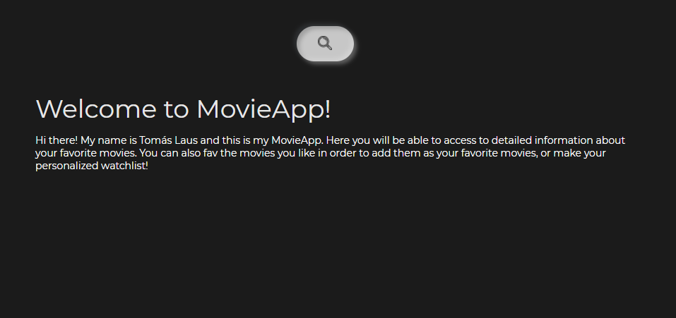

<h1 align="center"> MovieApp </h1>

  

This project was built with React, Redux, Node y Sequelize, also using and practicing testing.

This project uses the [OMDB](https://www.omdbapi.com/) API, and from it to be able to, among other things:

  - Search movies
  - View movie details
  - Add or remove movies from your favorites list

#### Required technologies:
- [ ] React
- [ ] Redux
